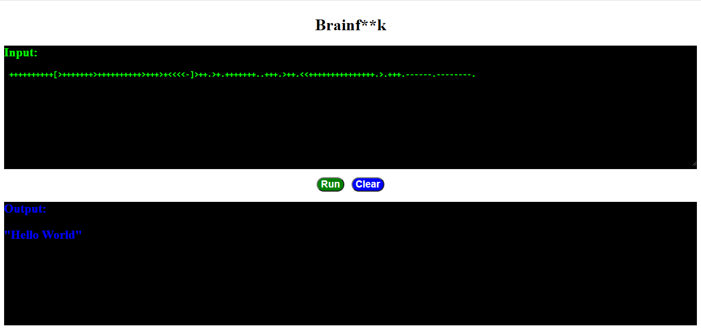

Brainf++k online
-----------------
Web App Brainfuck Intepreter

Live Demo
----------
[Brainfuck Intepreter App demo](https://brainf--k-online.herokuapp.com)

Requires
-------------
 * Python 3

Python Modules
--------------
 * pip install -r requirements.txt

Initializing the Flask
----------------------
 * set FLASK_APP=brainf++k.py

Run App
-------
* flask run

 open http://127.0.0.1:5000/

Exemple
-------
Input: ++++++++++[>+++++++>++++++++++>+++>+<<<<-]>++.>+.+++++++..+++.>++.<<+++++++++++++++.>.+++.------.--------.
Output: "Hello World!"

