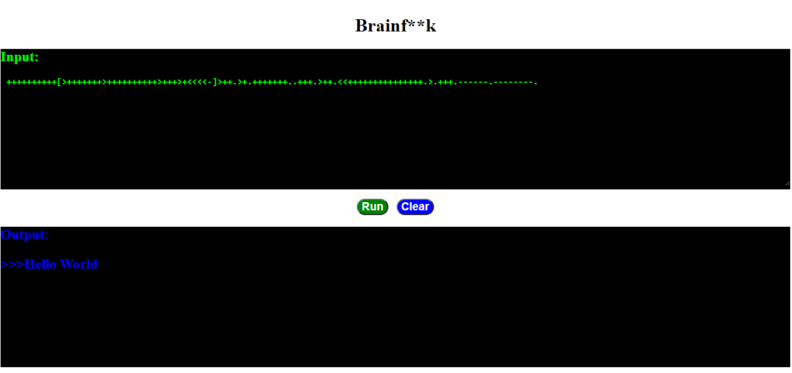

Brainf++k online
-----------------
Web App Brainfuck Interpreter using Flask and JQuery

 * Command `,` is currently down

Live Demo
----------
[Brainfuck Interpreter App demo](https://brainf-k-online.onrender.com)

Requires
-------------
 * Python 3

Python Modules
--------------
 * pip install -r requirements.txt

Initializing the Flask
----------------------
 * set FLASK_APP=app.py

Run App
-------
* flask run

 open http://127.0.0.1:5000/

Exemple
-------
 * Input: ++++++++++[>+++++++>++++++++++>+++>+<<<<-]>++.>+.+++++++..+++.>++.<<+++++++++++++++.>.+++.------.--------.
 * Output: "Hello World!"

